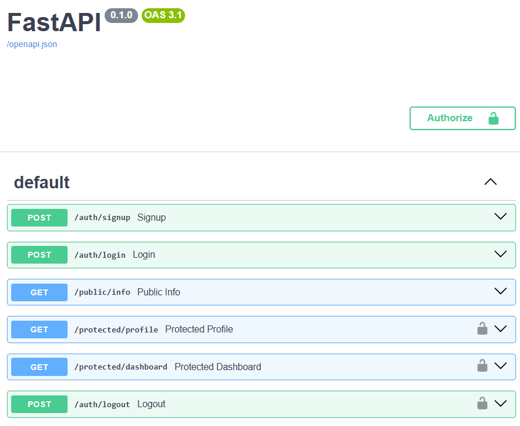

# Auth Login & Protect API

A secure FastAPI backend implementing signup, login, logout, and protected routes using Supabase Auth for identity management and JWT verification.

## What This Project Is

This API demonstrates a standard authentication flow: users sign up and log in through Supabase (the Identity Provider), receive a JWT access token, and must present that token to access protected endpoints. Token verification is handled via a reusable FastAPI dependency.

## Setup

1. Clone this repo
2. Create a virtual environment and activate it:
   \`\`\`bash
   python3 -m venv venv
   source venv/bin/activate  # Windows: venv\Scripts\activate
   \`\`\`
3. Install dependencies:
   \`\`\`bash
   pip install fastapi uvicorn python-dotenv supabase
   \`\`\`
4. Create a `.env` file in the project root:
   \`\`\`
   PROJECT_URL=your_supabase_project_url
   PUBLIC_KEY=your_supabase_anon_key
   PORT=3000
   \`\`\`
5. Get your own values from your Supabase project at Project Settings → API.

## Running the App

\`\`\`bash
uvicorn main:app --reload --port 3000
\`\`\`

Visit `http://localhost:3000/docs` for interactive Swagger documentation.

## API Reference

| Method | Endpoint | Auth Required | Description |
|--------|----------|----------------|-------------|
| POST | /auth/signup | No | Create a new user account |
| POST | /auth/login | No | Authenticate and receive JWT |
| POST | /auth/logout | Yes (Bearer token) | Terminate the user session |
| GET | /protected/profile | Yes (Bearer token) | Read private user profile |
| GET | /protected/dashboard | Yes (Bearer token) | Example second protected route |
| GET | /public/info | No | Read public, unprotected data |

## Swagger UI

## Notes

- Bearer tokens remain cryptographically valid until their expiry time, even after `/auth/logout` is called — this is expected Supabase behavior, since logout invalidates the session/refresh token server-side, not the already-issued JWT itself.